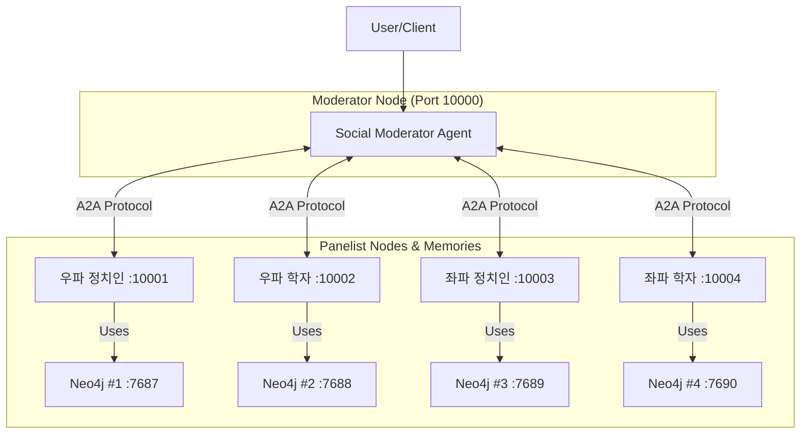

# H-AGM Multi-Agent Debate Platform (Integrated)

## 📋 프로젝트 개요

이 프로젝트는 \*\*H-AGM (Agentic Memory System)\*\*과 **A2A Protocol**을 결합한 다중 에이전트 토론 플랫폼입니다. 4명의 AI 패널리스트(좌/우파, 정치인/학자)와 1명의 AI 사회자가 실시간으로 토론을 진행하며, 각 에이전트는 독립적인 장기 기억(Memory)과 외부 도구(MCP)를 활용하여 논리적이고 사실에 기반한 토론을 수행합니다.

### 핵심 특징

  - **4인의 독립 패널리스트**: 각 패널리스트는 물리적으로 분리된 메모리 시스템을 가집니다.
  - **H-AGM 메모리 아키텍처**: Neo4j(Graph) + Qdrant(Vector)를 결합한 하이브리드 메모리 시스템.
  - **하이브리드 검색**: 벡터 검색과 그래프 확장을 결합한 고급 검색 방식 지원.
  - **ReAct & MCP 기반 추론**: 패널리스트는 답변 전 스스로 생각하고(ReAct), Tavily 검색 도구(MCP)를 사용해 정보를 검증합니다.
  - **동적 토론 진행**: 사회자는 정해진 라운드 외에도 토론의 품질을 판단하여 조기 종료하거나 연장할 수 있습니다.
  - **자동 토론 평가**: Debate Evaluator를 통한 4가지 방법론(DQI, AAF, DQI-AAF, AFRA) 기반 품질 평가.
  - **일괄 토론 실행**: 50개 이상의 주제를 파일에서 읽어 자동으로 실행 가능.
  - **다중 LLM 지원**: 5개 LLM 제공자(Grok, GPT, Gemini, Claude, Qwen) 지원. 각 에이전트별로 다른 LLM 사용 가능.
  - **대규모 평가 시스템**: 5개 LLM으로 생성된 토론을 5개 LLM으로 평가하는 대규모 평가 시스템 (최대 1,250개 평가).

-----

## 🏗️ 시스템 아키텍처



-----

## 🔧 사전 준비 및 설치

### 1\. 환경 변수 설정 (.env)

프로젝트 루트에 `.env` 파일을 생성합니다.

```env
# 필수: LLM 및 검색 도구
# 기본 LLM 제공자 설정 (gpt, grok, gemini, claude, qwen)
DEBATE_LLM_PROVIDER=gpt

# 각 LLM별 API 키 (사용하는 LLM만 설정)
OPENAI_API_KEY=sk-your-openai-api-key          # GPT
GROQ_API_KEY=gsk-your-groq-api-key             # Grok
GOOGLE_API_KEY=your-google-api-key             # Gemini
ANTHROPIC_API_KEY=sk-ant-your-api-key          # Claude
DASHSCOPE_API_KEY=sk-your-dashscope-api-key    # Qwen

TAVILY_API_KEY=tvly-your-tavily-api-key

# 선택사항: Neo4j (기본값 사용 시 생략 가능)
NEO4J_USER=neo4j
NEO4J_PASSWORD=password

# 선택사항: 토론 시스템 LLM 설정
PANELIST_LLM_PROVIDER=gpt      # 패널리스트 LLM (기본: DEBATE_LLM_PROVIDER)
PANELIST_LLM_MODEL=gpt-4o-mini
PANELIST_LLM_TEMPERATURE=0.7
MODERATOR_LLM_PROVIDER=gpt     # 사회자 LLM (기본: DEBATE_LLM_PROVIDER)
MODERATOR_LLM_MODEL=gpt-4o-mini
MODERATOR_LLM_TEMPERATURE=0.5
MEMORY_LLM_MODEL=gpt-4o-mini   # 메모리 분석 LLM

# 선택사항: Debate Evaluator LLM 설정
EVAL_LLM_PROVIDER=gpt          # 평가 LLM (기본: gpt)
EVAL_LLM_MODEL=gpt-4o
EVAL_LLM_TEMPERATURE=0.3
```

### 2\. 의존성 설치

`uv`를 사용하여 프로젝트 의존성을 설치합니다.

```bash
uv sync
```

-----

## 🚀 실행 가이드 (순서 중요)

시스템의 각 구성 요소는 의존성이 있으므로 **반드시 아래 순서대로 실행**해야 합니다.

### 1단계: Neo4j 인스턴스 (4개) 시작

각 패널리스트의 독립적인 메모리를 위해 4개의 Neo4j 컨테이너를 실행합니다.

**Windows PowerShell:**
```powershell
.\start_neo4j_panelists.ps1
```

**Linux/Mac:**
```bash
chmod +x start_neo4j_panelists.sh
./start_neo4j_panelists.sh
```

> **확인**: 실행 후 약 30초 대기. `docker ps`로 포트 7687~7690이 모두 떴는지 확인하세요.

### 2단계: 패널리스트 에이전트 시작

4명의 패널리스트 서버를 구동합니다. 이들은 자동으로 각자의 Neo4j 인스턴스에 연결됩니다.

**Windows PowerShell:**
```powershell
.\start_panelists.ps1
```

**Linux/Mac:**
```bash
chmod +x start_panelists.sh
./start_panelists.sh
```

> **확인**: 각 터미널 창에 "Memory system READY" 및 "server ready" 메시지가 뜰 때까지 대기하세요.

### 3단계: 모더레이터(사회자) 시작

패널리스트가 모두 준비된 후 사회자를 실행합니다.

**Windows PowerShell:**
```powershell
.\start_moderator.ps1
```

**Linux/Mac:**
```bash
chmod +x start_moderator.sh
./start_moderator.sh
```

### 4단계: 토론 클라이언트 실행

#### 단일 토론 실행

토론 주제를 입력하고 프로세스를 시작합니다.

**Windows PowerShell:**
```powershell
.\run_debate.ps1
```

**Linux/Mac:**
```bash
chmod +x run_debate.sh
./run_debate.sh
```

#### 일괄 토론 실행 (50개 주제)

여러 토론 주제를 파일에 저장하고 일괄 실행할 수 있습니다.

1. **주제 파일 준비**: `topics.txt` 파일을 생성하고 한 줄에 하나씩 주제를 입력
   ```
   인공지능이 인간의 일자리를 대체하는 것에 대해 어떻게 생각하는가?
   기본소득 도입의 필요성에 대해 논의하시오.
   기후변화 대응을 위한 탄소세 도입의 타당성
   ...
   ```

2. **일괄 실행**

   **Windows PowerShell:**
   ```powershell
   .\run_batch_debates.ps1 -TopicFile "topics.txt" -Delay 5.0
   ```

   **Linux/Mac:**
   ```bash
   chmod +x run_batch_debates.sh
   ./run_batch_debates.sh topics.txt http://localhost:10000 5.0 1
   ```

   **옵션:**
   - `TopicFile`: 주제 파일 경로 (필수)
   - `ModeratorUrl`: Moderator 서버 URL (기본: http://localhost:10000)
   - `Delay`: 주제 간 대기 시간(초) (기본: 5.0)
   - `StartFrom`: 시작할 주제 번호 (기본: 1, 중단 후 재개 시 유용)

3. **결과 확인**
   - 각 토론 결과는 `debate/` 디렉토리에 저장됩니다
   - 전체 요약은 `debate_batch_summary.json`에 저장됩니다

#### 다중 LLM 토론 실행 (5개 LLM × 50개 주제)

5개의 LLM(Grok, GPT, Gemini, Claude, Qwen)을 모두 사용하여 모든 주제로 토론을 실행할 수 있습니다.

**Windows PowerShell:**
```powershell
# 모든 LLM으로 모든 주제 실행
.\run_multi_llm_debates.ps1

# 특정 LLM만 사용
.\run_multi_llm_debates.ps1 -LLMProviders @("gpt", "claude")

# 옵션 지정
.\run_multi_llm_debates.ps1 -TopicFile "topics.txt" -Delay 5.0 -DelayLLMs 10.0
```

**Linux/Mac:**
```bash
chmod +x run_multi_llm_debates.sh
# 모든 LLM으로 모든 주제 실행
./run_multi_llm_debates.sh

# 특정 LLM만 사용
./run_multi_llm_debates.sh topics.txt "gpt claude"

# 옵션 지정
./run_multi_llm_debates.sh topics.txt "gpt grok gemini claude qwen" http://localhost:10000 5.0 10.0 1 1
```

**Python 직접 실행:**
```bash
# 모든 LLM으로 실행
uv run python src/client/run_multi_llm_debates.py topics.txt

# 특정 LLM만 사용
uv run python src/client/run_multi_llm_debates.py topics.txt --llm-providers gpt claude

# 중단 후 재개 (3번째 LLM의 20번째 주제부터)
uv run python src/client/run_multi_llm_debates.py topics.txt --start-from-llm 3 --start-from-topic 20
```

**옵션:**
- `--llm-providers`: 사용할 LLM 목록 (기본: 모든 LLM)
- `--delay`: 주제 간 대기 시간(초) (기본: 5.0)
- `--delay-llms`: LLM 간 대기 시간(초) (기본: 10.0)
- `--start-from-llm`: 시작할 LLM 번호 (기본: 1)
- `--start-from-topic`: 첫 LLM의 시작 주제 번호 (기본: 1)

**결과 구조:**
- 각 LLM별 토론 결과: `debate/<llm>/` 디렉토리
- LLM별 요약: `debate_batch_summary_<llm>.json`
- 전체 요약: `debate_multi_llm_summary.json`

**총 토론 수:** 5개 LLM × 50개 주제 = **250개 토론**

> **예상 소요 시간**: 각 토론당 약 5-10분이 소요되므로, 250개 토론은 약 20-40시간이 걸릴 수 있습니다. 필요시 `--delay` 옵션을 조정하거나 특정 LLM만 선택하여 실행하세요.

### Neo4j 인스턴스 중지

**Windows PowerShell:**
```powershell
.\stop_neo4j_panelists.ps1
```

**Linux/Mac:**
```bash
chmod +x stop_neo4j_panelists.sh
./stop_neo4j_panelists.sh
```

### 5단계: Debate Evaluator 설정 (선택사항)

토론 평가 기능을 사용하려면 Debate Evaluator를 설치해야 합니다.

```bash
cd debate-evaluator-main
uv sync
cd ..
```

또는 메인 프로젝트에서 이미 의존성이 설치되어 있으므로 바로 사용할 수 있습니다.

### 6단계: 토론 평가 (선택사항)

토론이 완료된 후, Debate Evaluator를 사용하여 토론 품질을 평가할 수 있습니다.

**Windows PowerShell:**
```powershell
# 최신 토론 파일 자동 평가 (전체 모드)
.\evaluate_debate.ps1

# 특정 파일 평가
.\evaluate_debate.ps1 -DebateFile "debate\20241226_123456_topic.json" -Mode "dqi"

# 특정 모드로 평가 (dqi, aaf, dqi-aaf, afra, all)
.\evaluate_debate.ps1 -Mode "all"
```

**Linux/Mac:**
```bash
# 최신 토론 파일 자동 평가 (전체 모드)
chmod +x evaluate_debate.sh
./evaluate_debate.sh

# 특정 파일 평가
./evaluate_debate.sh "debate/20241226_123456_topic.json" "dqi"

# 특정 모드로 평가
./evaluate_debate.sh "" "all"
```

**평가 모드:**
- `dqi`: Discourse Quality Index (담론 품질 지수)
- `aaf`: Argumentation, Authority, Flow
- `dqi-aaf`: DQI-AAF 하이브리드 모델
- `afra`: Rhetorical Analysis (수사학적 분석)
- `all`: 모든 방법론으로 평가 (권장)

평가 결과는 `debate_results/` 디렉토리에 저장됩니다.

#### 다중 LLM 토론 일괄 평가

5개 LLM으로 생성된 모든 토론을 5개 LLM으로 평가할 수 있습니다.

**Windows PowerShell:**
```powershell
# 모든 토론을 모든 평가 LLM으로 평가
.\evaluate_multi_llm_debates.ps1

# 특정 평가 LLM만 사용
.\evaluate_multi_llm_debates.ps1 -EvalLLMProviders @("gpt", "claude")

# 특정 토론 LLM만 평가
.\evaluate_multi_llm_debates.ps1 -DebateLLMProviders @("gpt", "grok")

# 특정 평가 모드만 사용
.\evaluate_multi_llm_debates.ps1 -EvaluationMode "dqi"
```

**Linux/Mac:**
```bash
chmod +x evaluate_multi_llm_debates.sh
# 모든 토론을 모든 평가 LLM으로 평가
./evaluate_multi_llm_debates.sh

# 특정 평가 LLM만 사용
./evaluate_multi_llm_debates.sh debate "gpt claude" "" all debate_results 2.0
```

**Python 직접 실행:**
```bash
# 모든 토론을 모든 평가 LLM으로 평가
uv run python scripts/run_multi_llm_evaluation.py

# 특정 옵션 지정
uv run python scripts/run_multi_llm_evaluation.py \
    --debate-dir debate \
    --eval-llm-providers gpt claude \
    --evaluation-mode all \
    --output-dir debate_results \
    --delay 2.0
```

**결과 구조:**
```
debate_results/
├── gpt/              # GPT로 생성된 토론
│   ├── gpt/          # GPT로 평가한 결과
│   ├── grok/         # Grok으로 평가한 결과
│   ├── gemini/       # Gemini로 평가한 결과
│   ├── claude/       # Claude로 평가한 결과
│   └── qwen/         # Qwen으로 평가한 결과
├── grok/             # Grok으로 생성된 토론
│   └── ...
└── evaluation_multi_llm_summary.json  # 전체 요약
```

**총 평가 수:** 5개 토론 LLM × 50개 주제 × 5개 평가 LLM = **1,250개 평가**

> **참고**: 평가는 시간이 오래 걸릴 수 있습니다. 각 평가당 약 1-2분이 소요되므로, 1,250개 평가는 약 20-40시간이 걸릴 수 있습니다. 필요시 `--delay` 옵션을 조정하거나 특정 LLM만 선택하여 실행하세요.

#### Debate Evaluator 설정

Debate Evaluator를 사용하려면 `.env` 파일에 다음 환경 변수를 추가하세요:

```env
# Debate Evaluator 설정 (선택사항)
# OPENAI_API_KEY가 이미 설정되어 있으면 DEBATE_EVAL_OPENAI_API_KEY는 생략 가능
DEBATE_EVAL_OPENAI_API_KEY=sk-your-api-key-here
DEBATE_EVAL_OPENAI_MODEL=gpt-4o
```

> **참고**: Debate Evaluator는 `debate-evaluator-main/` 서브디렉토리에서 실행되므로, 해당 디렉토리에서 `uv sync`를 실행해야 합니다. 메인 프로젝트의 의존성은 평가 스크립트 실행에 필요한 기본 패키지만 포함합니다.
> 
> **중요**: Debate Evaluator의 상세 문서는 메인 README.md의 "Debate Evaluator 통합" 섹션을 참조하세요.

-----

## 🧠 시스템 상세 명세

### 1\. H-AGM 메모리 시스템 (Memory Layer)

각 패널리스트는 **완전히 격리된 메모리 공간**을 가집니다. 데이터 혼재나 락(Lock) 문제를 방지하기 위해 물리적으로 분리되었습니다.

| 패널리스트 | 포트 | Neo4j 포트 | User ID | Mem0 홈 디렉토리 | 벡터 스토어 경로 |
|:---:|:---:|:---:|:---:|:---|:---|
| **우파 정치인** | 10001 | 7687 | `panelist_right_politician` | `%TEMP%\mem0_home\panelist_right_politician` | `%TEMP%\qdrant_storage\panelist_right_politician` |
| **우파 학자** | 10002 | 7688 | `panelist_right_scholar` | `%TEMP%\mem0_home\panelist_right_scholar` | `%TEMP%\qdrant_storage\panelist_right_scholar` |
| **좌파 정치인** | 10003 | 7689 | `panelist_left_politician` | `%TEMP%\mem0_home\panelist_left_politician` | `%TEMP%\qdrant_storage\panelist_left_politician` |
| **좌파 학자** | 10004 | 7690 | `panelist_left_scholar` | `%TEMP%\mem0_home\panelist_left_scholar` | `%TEMP%\qdrant_storage\panelist_left_scholar` |

> **참고**: Linux/Mac에서는 `%TEMP%` 대신 `/tmp`를 사용합니다.

#### 메모리 저장 방식 (Fallback 저장)

  * **Fallback 저장 방식**: mem0의 엔티티 추출 오류를 방지하기 위해 Neo4j에 직접 Cypher 쿼리로 저장합니다.
  * **저장되는 데이터**:
    * 메모리 내용 (`memory`, `content`, `text` 필드)
    * A-mem 분석 결과: 맥락(`amem_context`), 태그(`amem_tags`), 키워드(`amem_keywords`)
    * 메타데이터: 생성 시간, 사용자 ID 등
  * **검색 방식**: 메모리 내용, 맥락, 태그, 키워드 필드를 모두 검색하여 관련 메모리를 찾습니다.
  * **메모리 검색 타이밍**: 2번째 라운드부터만 과거 메모리를 검색합니다 (첫 번째 라운드에는 저장된 기억이 없음).

  * **검증 방법**: `uv run python test_memory_separation.py` 실행 시 각 메모리가 분리되어 작동함을 확인할 수 있습니다.

#### 하이브리드 검색 (Hybrid Retrieval)

H-AGM은 벡터 검색과 그래프 확장을 결합한 하이브리드 검색 방식을 지원합니다.

**검색 프로세스:**

1. **Stage 1 - Vector Retrieval**: 쿼리와의 의미적 유사도를 기반으로 top-k 후보를 검색
2. **Stage 2 - Graph Expansion**: 각 후보 노드에서 그래프 엣지를 따라 distance d 내의 관련 노드를 탐색
3. **Stage 3 - Integration**: 벡터 유사도와 그래프 centrality를 결합한 점수로 순위화
   ```
   score(a_i) = α · sim(q, a_i) + (1-α) · centrality(a_i)
   ```

**하이퍼파라미터:**
- `k`: 벡터 검색 결과 수 (기본: 5)
- `alpha`: 유사도 가중치 (기본: 0.7, 범위: 0.0~1.0)
- `max_distance`: 그래프 확장 최대 거리 (기본: 2 hop)
- `max_nodes`: 그래프 확장 최대 노드 수 (기본: 20)

**관계 생성:**
- 메모리 저장 시 키워드/태그/맥락이 겹치는 기존 메모리와 자동으로 `RELATED_TO` 관계 생성
- 그래프 구조를 통해 관련 메모리 간 연결성 확보

### 2\. 사회자 (Moderator) 로직 개선

복잡한 부주제(Subtopic) 방식을 제거하고 **단일 주제 중심의 동적 라운드 시스템**으로 개편되었습니다.

  * **진행 흐름**: `Research` (MCP) → `Round 1~5` → `Finalize`
  * **동적 종료 판단 (Smart Termination)**:
      * 기본 5라운드 진행.
      * **Round 3 이후**부터 매 라운드 종료 시 LLM이 토론 지속 여부(`CONTINUE` or `STOP`)를 판단.
      * 판단 기준: 새로운 관점 제시 여부, 토론 심화 정도, 주장 반복 여부.

### 3\. 패널리스트 (Panelist) 기능 강화

#### A. ReAct 패턴 및 MCP 도구 적용

패널리스트는 답변 생성 시 내부 루프(최대 5회)를 돌며 도구를 사용할지 결정합니다.

  * **사용 도구**:
      * `search_web_tool`: 웹 검색 (Tavily) 🔍
      * `verify_fact_tool`: 사실 검증 ✓
      * `get_context_tool`: 배경 지식 확보 📚
  * **로그**: 도구 사용 시 `🔍 [TOOL] search_web_tool called...`와 같이 실시간 로그가 출력됩니다.

#### B. 응답 길이 및 품질 개선

단답형 답변을 방지하고 실제 토론과 유사한 분량을 생성합니다.

  * **목표 분량**: 약 2분 발언 분량 (600\~800자).
  * **구조**:
    1.  **의견 (Opinion)**: 핵심 주장 (150\~250자)
    2.  **근거 (Reasoning)**: 논리적/사실적 뒷받침 (450\~950자)

#### C. 메모리 활용 전략

  * **메모리 검색 타이밍**: 2번째 라운드부터만 과거 메모리를 검색합니다.
    * Round 1: 저장된 기억이 없으므로 메모리 검색 없음
    * Round 2+: 과거 발언 및 검색 결과를 메모리에서 검색하여 활용
  * **메모리 검색 범위**: 메모리 내용, 키워드, 태그, 맥락 정보를 모두 검색
  * **메모리 활용**: 과거 발언 참고, 상대 진영 반박, 같은 진영 지원 등에 활용

-----

## ⚠️ 문제 해결 (Troubleshooting)

**Q1. Neo4j 연결 실패**

  * Docker 컨테이너 상태를 확인하세요:
    - Windows: `docker ps | findstr neo4j`
    - Linux/Mac: `docker ps | grep neo4j`
  * 4개의 컨테이너가 모두 실행 중이어야 합니다. 하나라도 죽어있다면:
    - Windows: `.\start_neo4j_panelists.ps1`을 다시 실행
    - Linux/Mac: `./start_neo4j_panelists.sh`를 다시 실행

**Q2. 패널리스트가 계속 로딩 중일 때**

  * 메모리 초기화에 시간이 걸릴 수 있습니다. 특히 최초 실행 시 Qdrant 및 Neo4j 데이터 생성에 30초~1분 정도 소요됩니다.

**Q3. 파일 잠금 오류 (WinError 32 또는 "파일을 사용 중")**

  * 각 패널리스트가 독립적인 Mem0 홈 디렉토리와 Qdrant 경로를 사용하도록 설정되어 있습니다.
  * 문제가 계속되면:
    1. 모든 패널리스트 프로세스를 종료
    2. 임시 디렉토리 정리:
       - Windows: `Remove-Item -Recurse -Force "$env:TEMP\mem0_home" -ErrorAction SilentlyContinue`
       - Linux/Mac: `rm -rf /tmp/mem0_home`
    3. 패널리스트를 다시 시작

**Q4. 토론이 3라운드에서 갑자기 끝납니다.**

  * 오류가 아닙니다. 사회자의 **동적 종료 로직**이 토론이 충분하다고 판단(STOP)했기 때문입니다.

**Q5. mem0 엔티티 추출 오류 (`entity_type` 관련 오류)**

  * 현재 시스템은 **Fallback 저장 방식**을 사용하여 mem0의 엔티티 추출 기능을 우회합니다.
  * **Fallback 저장 방식**:
    * mem0 라이브러리를 거치지 않고 Neo4j에 직접 Cypher 쿼리로 저장
    * 엔티티 추출 오류 없이 안정적으로 메모리 저장
    * A-mem 분석 결과(키워드, 태그, 맥락)를 모두 보존
  * **장점**:
    * mem0의 엔티티 추출 오류 완전 방지
    * Neo4j 직접 저장으로 빠른 성능
    * 안정적인 메모리 저장 및 검색
  * **참고**: 검색은 mem0의 벡터 검색 기능을 사용하되, 저장은 Fallback 방식으로 처리됩니다.

#### 하이브리드 검색 (Hybrid Retrieval)

H-AGM은 벡터 검색과 그래프 확장을 결합한 하이브리드 검색 방식을 지원합니다.

**검색 프로세스:**

1. **Stage 1 - Vector Retrieval**: 쿼리와의 의미적 유사도를 기반으로 top-k 후보를 검색
2. **Stage 2 - Graph Expansion**: 각 후보 노드에서 그래프 엣지를 따라 distance d 내의 관련 노드를 탐색
3. **Stage 3 - Integration**: 벡터 유사도와 그래프 centrality를 결합한 점수로 순위화
   ```
   score(a_i) = α · sim(q, a_i) + (1-α) · centrality(a_i)
   ```

**하이퍼파라미터:**
- `k`: 벡터 검색 결과 수 (기본: 5)
- `alpha`: 유사도 가중치 (기본: 0.7, 범위: 0.0~1.0)
- `max_distance`: 그래프 확장 최대 거리 (기본: 2 hop)
- `max_nodes`: 그래프 확장 최대 노드 수 (기본: 20)

**관계 생성:**
- 메모리 저장 시 키워드/태그/맥락이 겹치는 기존 메모리와 자동으로 `RELATED_TO` 관계 생성
- 그래프 구조를 통해 관련 메모리 간 연결성 확보

### 4\. Debate Evaluator 통합

토론 완료 후 자동으로 토론 품질을 평가할 수 있습니다.

#### 지원하는 평가 방법론

| 모드 | 설명 | 점수 체계 |
|------|------|-----------|
| `dqi` | Discourse Quality Index - 담론 품질 지수 | 7개 범주, 0-3점 |
| `aaf` | Argumentation, Authority, Flow | 3개 기준, 1-5점 |
| `dqi-aaf` | DQI-AAF 하이브리드 모델 | 논증 노드별 0-18점 |
| `afra` | Rhetorical Analysis - 수사학적 분석 | 10개 기준, 0-10점 |

#### 평가 방법론 상세

**DQI (Discourse Quality Index)**
- 7가지 범주로 토론의 담론 품질 평가
- 참여 평등, 정당화 수준/내용, 집단/요구/반론에 대한 존중, 건설적인 정치

**AAF (Argumentation, Authority, Flow)**
- 논증의 명확성, 일관성, 깊이
- 근거의 신뢰성, 전문성
- 구조, 반박 효과성, 전달력

**DQI-AAF 하이브리드**
- 각 발언을 논증 노드로 식별
- DQI 가중치와 논증 간 공격 관계 분석

**AFRA (Rhetorical Analysis)**
- Logos (논리), Ethos & Pathos (수사), Technique, Language
- 4대 영역 10개 기준으로 수사학적 품질 평가

-----

## 📁 주요 파일 구조

```
.
├── src/
│   ├── shared/
│   │   ├── memory_layer.py      # H-AGM 메모리 코어 (A-mem/Mem0g)
│   │   ├── mcp_tools.py         # Tavily 검색 도구 및 MCP 클라이언트
│   │   └── models.py            # 공통 데이터 모델
│   ├── panelist/
│   │   ├── agent.py             # 패널리스트 로직 (ReAct Loop 포함)
│   │   └── personas.py          # 4인 페르소나 정의
│   ├── moderator/
│   │   ├── agent.py             # 사회자 로직 (동적 라운드 판단)
│   │   └── agent_executor.py    # 실행 및 아티팩트 생성
│   └── client/                  # 테스트 클라이언트
├── start_neo4j_panelists.ps1    # Neo4j 4개 시작 (Windows)
├── start_neo4j_panelists.sh     # Neo4j 4개 시작 (Linux/Mac)
├── stop_neo4j_panelists.ps1     # Neo4j 4개 중지 (Windows)
├── stop_neo4j_panelists.sh      # Neo4j 4개 중지 (Linux/Mac)
├── start_panelists.ps1          # 패널리스트 시작 (Windows)
├── start_panelists.sh           # 패널리스트 시작 (Linux/Mac)
├── start_moderator.ps1          # 모더레이터 시작 (Windows)
├── start_moderator.sh           # 모더레이터 시작 (Linux/Mac)
├── run_debate.ps1               # 토론 클라이언트 실행 (Windows)
├── run_debate.sh                # 토론 클라이언트 실행 (Linux/Mac)
├── evaluate_debate.ps1          # 토론 평가 실행 (Windows)
├── evaluate_debate.sh           # 토론 평가 실행 (Linux/Mac)
├── run_multi_llm_debates.ps1   # 다중 LLM 토론 실행 (Windows)
├── run_multi_llm_debates.sh    # 다중 LLM 토론 실행 (Linux/Mac)
├── evaluate_multi_llm_debates.ps1  # 다중 LLM 토론 평가 (Windows)
├── evaluate_multi_llm_debates.sh   # 다중 LLM 토론 평가 (Linux/Mac)
├── initialize_hagm_memories.py  # 메모리 시스템 초기화 테스트
├── test_memory_separation.py    # 메모리 분리 테스트
├── scripts/
│   ├── convert_debate_for_evaluation.py  # 토론 결과를 평가 형식으로 변환
│   ├── run_debate_with_evaluation.py    # 토론 평가 실행 스크립트
│   ├── run_batch_with_evaluation.py     # 일괄 토론 + 평가 통합 스크립트
│   └── run_multi_llm_evaluation.py      # 다중 LLM 토론 일괄 평가 스크립트
├── debate-evaluator-main/              # Debate Evaluator 서브프로젝트
│   ├── src/debate_evaluator/           # 평가 시스템 소스
│   └── pyproject.toml                  # Evaluator 의존성
├── topics.txt                          # 토론 주제 목록 (50개)
├── run_batch_debates.ps1              # 일괄 토론 실행 (Windows)
├── run_batch_debates.sh               # 일괄 토론 실행 (Linux/Mac)
├── README.md                          # 이 파일
└── README_LLM_SETUP.md               # 다중 LLM 설정 가이드
```

## 🔌 다중 LLM 지원

이 프로젝트는 5개의 LLM 제공자를 지원합니다:
- **GPT** (OpenAI)
- **Grok** (via Groq)
- **Gemini** (Google)
- **Claude** (Anthropic)
- **Qwen** (Alibaba Cloud DashScope)

각 에이전트(패널리스트, 사회자)와 평가 시스템에서 서로 다른 LLM을 사용할 수 있습니다.

### 주요 기능

1. **토론 시스템 다중 LLM 지원**
   - 각 패널리스트와 사회자가 서로 다른 LLM 사용 가능
   - 환경 변수로 LLM 선택 및 모델 설정

2. **평가 시스템 다중 LLM 지원**
   - 각 평가 방법론별로 다른 LLM 사용 가능
   - 토론 LLM과 평가 LLM의 조합 분석 가능

3. **대규모 실험 지원**
   - 5개 LLM × 50개 주제 = 250개 토론
   - 250개 토론 × 5개 평가 LLM = 1,250개 평가
   - LLM별, 주제별 성능 비교 분석

자세한 설정 방법은 [README_LLM_SETUP.md](README_LLM_SETUP.md)를 참조하세요.